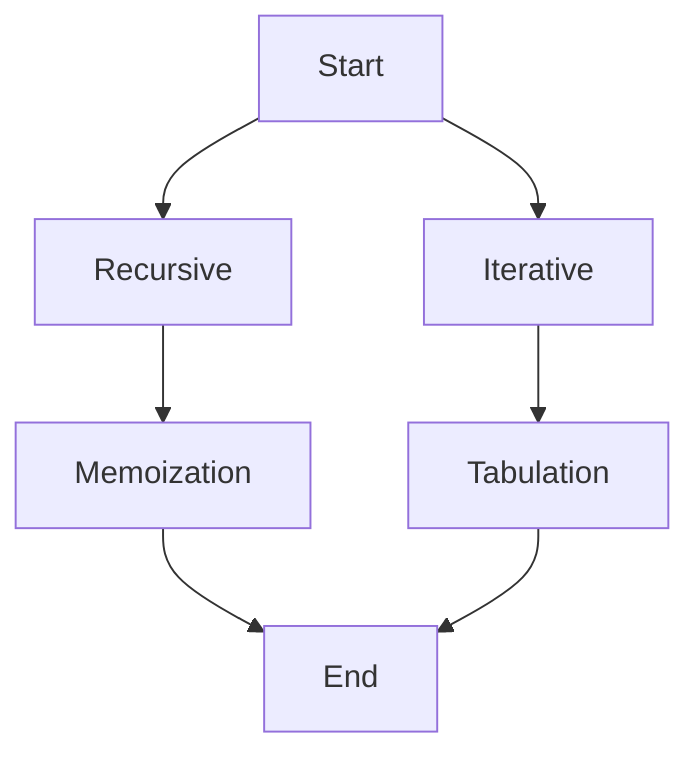

## Introduction

To use dynamic programming, there are two paths.

- Top-down: Recursive Function+Memoization
- Bottom-up: Iterative Loop+Tabulation



The first approach uses recursive function+dictionary (hash table) and it is also called a top-down method. The second approach uses for-loop+list (array) and it is also called a bottom-up method.

## Jouseki

The Fibonacci problem is always used for demonstration of the dynamic programming algorithms.

#### Bottom-up Dynamic Programming

```{python}
def fib(n):
    if n == 0:
        return 0
    if n == 1:
        return 1
    
    table = [None] * (n+1)
    table[0] = 0
    table[1] = 1
    
    for i in range(2, n+1):
        table[i] = table[i-1]+table[i-2]
    return table[n]
```

#### Top-down Dynamic Programming

```{python}
memo = {}
def fib(n):
    if n == 0:
        return 0
    if n == 1:
        return 1
    elif n in memo:
        return memo[n]
    else:
        memo[n] = fib(n-1)+fib(n-2)
        return memo[n]
```

Despite its fancy name, anyone can understand the basic idea of dynamic programming with minutes. The difficulty lies in how to divide a problem into homogeneous subproblems. In the Fibonacci problem, this is obvious as ``fib(n)=fib(n-1)+fib(n-2)``, however, finding relationship is not a trivial task.

Overall, the bottom-up method is better than top-down method in terms of time and space but the top-down method is more readable and sometimes easier to come up with.

## Derivations

